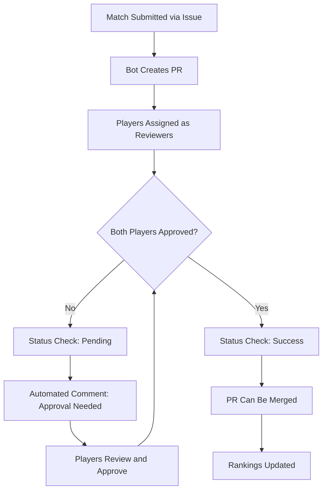

# Match Approval Requirements

This document explains how to ensure that all players involved in a tennis match must approve the match results before they are officially recorded.

## Overview

The tennis match tracker supports requiring approval from all participants before matches are recorded. This prevents disputes and ensures accuracy by requiring both players to confirm the match results.

## Implementation Options

### Option 1: Branch Protection Rules (Recommended)

This is the most robust and user-friendly approach:

#### Setup Instructions

1. **Navigate to Branch Protection Settings**
   - Go to your repository Settings → Branches
   - Click "Add branch protection rule"
   - Set branch name pattern to `main` (or your default branch)

2. **Configure Required Settings**
   - ✅ **Require a pull request before merging**
   - ✅ **Require approvals** (set to **2** - one for each player)
   - ✅ **Dismiss stale PR approvals when new commits are pushed**
   - ✅ **Require status checks to pass before merging**
   - ✅ **Require branches to be up to date before merging**

3. **Optional but Recommended Settings**
   - ✅ **Include administrators** (ensures even repo admins follow approval process)
   - ✅ **Require status checks**: `tennis/match-approval` (if using the automated workflow)

#### How It Works

- When a match is submitted via issue, a PR is automatically created
- Both players are assigned as reviewers
- The PR cannot be merged until both players approve
- GitHub enforces this at the platform level

### Option 2: Automated Workflow Checks

The repository includes a GitHub Action (`.github/workflows/require-match-approval.yml`) that:

- Monitors all match-related PRs
- Tracks approval status from both players
- Creates status checks that prevent merging until both players approve
- Posts helpful comments guiding players through the approval process

#### Features

- **Real-time Status Updates**: Shows approval progress in PR status checks
- **Smart Comments**: Automatically updates comments as approvals come in
- **Player Identification**: Extracts player usernames from PR content
- **Celebration**: Updates comments when all players have approved

### Option 3: Manual Process

Without automated enforcement, you can still require approvals through:
- Repository guidelines and documentation
- Manual verification before merging
- Team discipline and process adherence

## Verification Tools

### Branch Protection Checker Script

Use the included script to verify your branch protection setup:

```bash
# Install dependencies
pip install -r requirements.txt

# Set your GitHub token
export GITHUB_TOKEN=your_token_here

# Check branch protection
python scripts/check_branch_protection.py your-username your-repo-name
```

The script will:
- ✅ Verify branch protection is configured
- 📋 Analyze current settings
- 💡 Provide improvement recommendations
- 📝 Show setup instructions if needed

## Player Experience

### For Match Submitters

1. **Submit Match**: Create an issue using the match template
2. **Wait for PR**: Bot automatically creates a pull request
3. **Review Required**: Both players must approve the PR
4. **Merge**: Once approved, the match is officially recorded

### For Match Participants

1. **Notification**: Receive GitHub notification about PR review request
2. **Review Match**: Check the match data for accuracy
3. **Approve or Request Changes**: Use GitHub's review system
4. **Confirmation**: Match is recorded once both players approve

### Approval Workflow



## Troubleshooting

### Common Issues

**PR can be merged without approvals**
- ✓ Check that branch protection is enabled for the correct branch
- ✓ Verify "Require approvals" is set to 2 or more
- ✓ Ensure "Include administrators" is enabled

**Players not receiving review notifications**
- ✓ Verify players' GitHub usernames are correct in `players.yml`
- ✓ Check that players have notifications enabled in GitHub settings
- ✓ Confirm players are added as reviewers in the PR

**Status checks not appearing**
- ✓ Ensure the approval workflow file is in `.github/workflows/`
- ✓ Check that GitHub Actions are enabled in repository settings
- ✓ Verify workflow has proper permissions

### Manual Verification

To manually verify a match approval:

1. Open the match PR
2. Check the "Files changed" tab for match data accuracy
3. Verify both players are listed as reviewers
4. Confirm both have submitted "APPROVED" reviews
5. Check that no "Request changes" reviews are blocking

## Best Practices

### Repository Setup
- ✅ Enable branch protection before recording first match
- ✅ Test the approval process with a dummy match
- ✅ Document the approval process for your league
- ✅ Set up notifications for PR activity

### Player Guidelines
- 📖 Review match data carefully before approving
- 🚨 Use "Request changes" if match details are incorrect
- 💬 Add comments to explain any concerns
- ⏰ Respond to approval requests promptly

### League Administration
- 🔍 Regular audits of branch protection settings
- 📊 Monitor approval response times
- 🎯 Establish clear timelines for match approval
- 🆘 Have a process for disputed matches

## Security Considerations

- Branch protection prevents unauthorized match modifications
- Approval requirements create an audit trail
- Status checks provide additional validation layers
- Repository permissions control who can merge PRs

## Migration from Non-Approval System

If you're adding approval requirements to an existing league:

1. **Announce the Change**: Notify all players about new approval process
2. **Enable Protection**: Set up branch protection rules
3. **Test Process**: Run through approval workflow with test match
4. **Update Documentation**: Ensure league rules reflect approval requirements
5. **Monitor Initially**: Watch first few matches to ensure smooth process

## Advanced Configuration

### Custom Status Checks

You can add additional required status checks:
- Code quality checks
- Match data validation
- League rule compliance
- Custom approval workflows

### Integration with League Management

- Connect with league databases
- Automated tournament bracket updates
- Integration with external ranking systems
- Custom notification systems

---

For questions or issues with match approvals, please open an issue in the repository or contact your league administrator.
